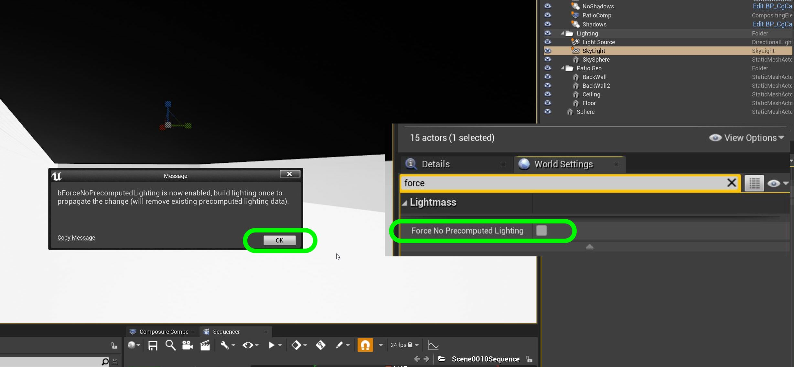
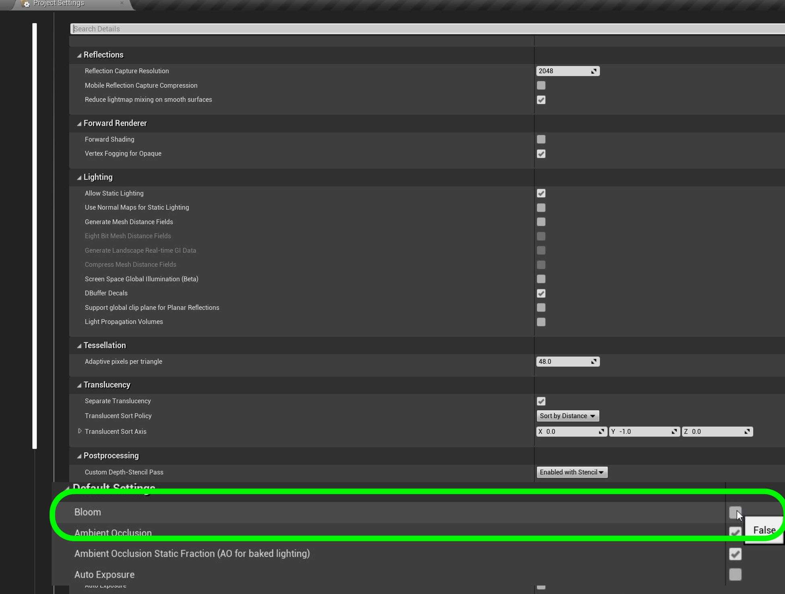
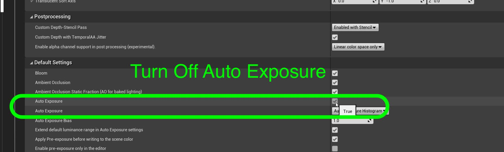
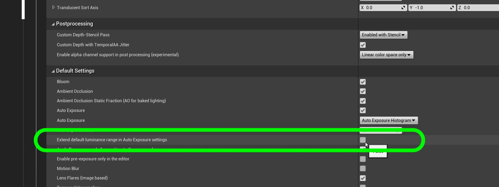

## Advanced Lighting

1. Go to World Settings and turn on **Force No Precomputed Lighting** and press **OK**.  This will make sure that no lights are baked and everything is dynamic. We want a tick mark in this box.

***

2. Open up **Edit | Project Settings | Renderer** and adjust **Custom Depth-Path Stencil Pass** to **Enabled with Stencil**.

***

3. Turn ON the bloom so that any light will  bloom if the lens points at a light source like the sun.

***

4.  Turn auto exposure off.  We do not want the lense to open up in the shadows.

***

5.  Turn off **Extend default luminance range in Auto Exposure Settings**.

***

--- [Next Chapter - ??](../shadow_matte/README.md) ------ [Back to Home Page](../README.md)