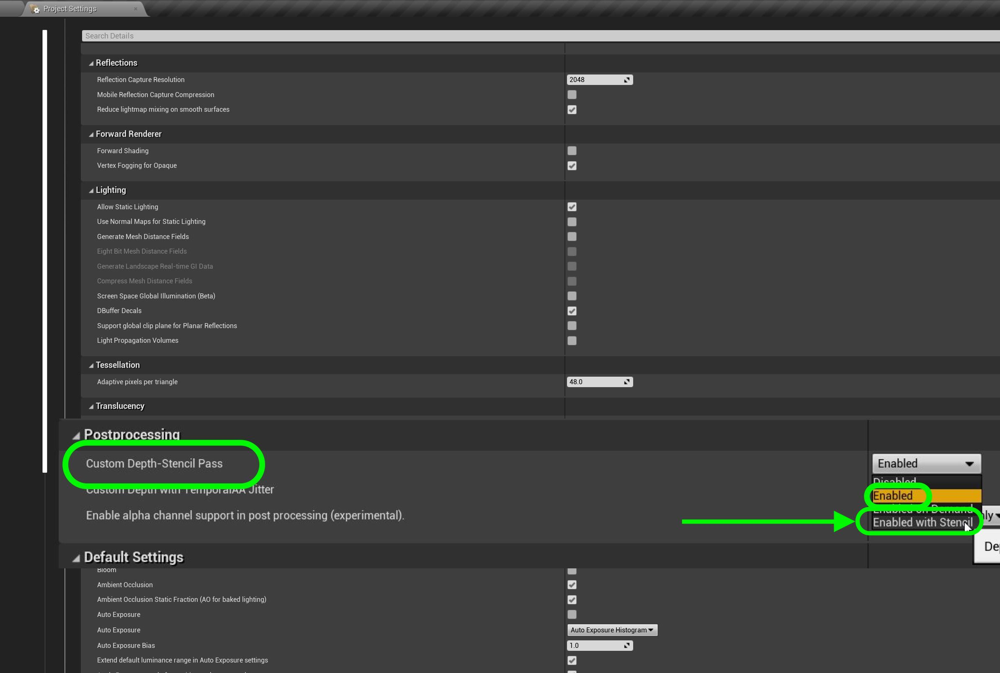
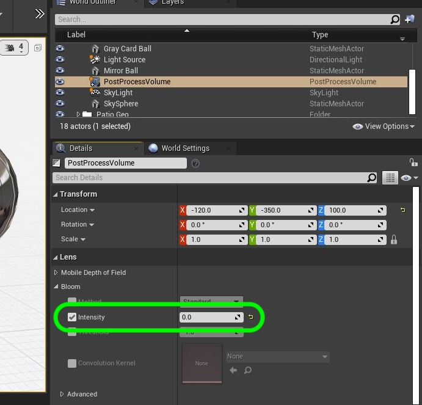
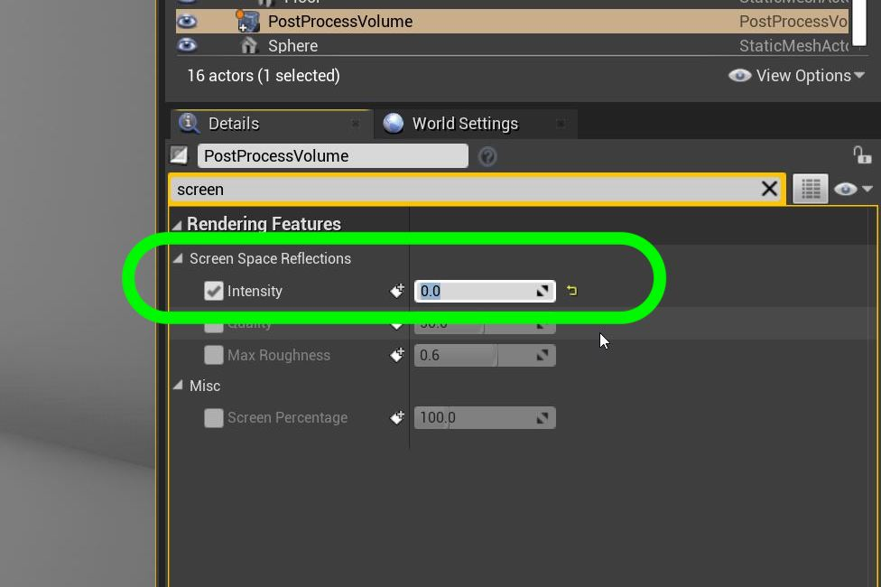

[Previous](../shadow_matte/README.md)&nbsp;&nbsp;&nbsp;<------>&nbsp;&nbsp;&nbsp;&nbsp;[Home](../README.md)&nbsp;&nbsp;<------>&nbsp;&nbsp;&nbsp;[Next Chapter - Lens Distortion](../lens_distortion/README.md)

## Advanced Lighting

1. Go to World Settings and turn on **Force No Precomputed Lighting** and press **OK**.  This will make sure that no lights are baked and everything is dynamic. We want a tick mark in this box.

***

2. Open up **Edit | Project Settings | Renderer** and adjust **Custom Depth-Path Stencil Pass** to **Enabled with Stencil**.

***

3. Turn ON the bloom so that any light will  bloom if the lens points at a light source like the sun.

***

5.  Turn off **Extend default luminance range in Auto Exposure Settings**.

***

6. Turn **off** lens flares.

***

7. Turn **on** motion blur.

***

8. Turn **GBuffer Format** to **Default**.

***

9. Turn on **Use GPU for computing morph targets**.

***

10. Change the **Reflection Capture Resolution** to `128`.

***

11. Check out the game in the **Mannequin** layer.

***

12.  We also want to do some post alterations by adding a very powerful actor in Unreal with a **Visual Effects | Post Process Volume**.

***

13. Now we want this volume to affect the entire level. Adjust the **Post Process Volume Settings**.

***

14. Set **Bloom Intensity** to `0`.

***

15.  First we will adjust the auto exposure range to not change exposures from `1` a min to `1` at max.

***

16. Since the camera lens has no vignette we will set the **Lens | Image Effects | Vignette Intensity** to `0` to effectively turn it off.

***

17. Adjust the **Film | Toe** to `.426291` 

*The part of the curve associated with relatively low exposures is designated the toe.  When an image is exposed so that areas fall within the toe region, little or no contrast is transferred to the image.* - http://www.sprawls.org/ppmi2/FILMCON/

***

168 Adjust the **Rendering Features | Ambient Occlusion | Intensity** to `0.8` and **Radus** to `25`.

***

19. Turn off reflection intensity by adjusting **Rendering Features | Screen Space Reflections | Intensity** to `0`.

***

20.  Now look at the **Patio Comp** layer and see all the lighting changes made.

***

[Previous](../shadow_matte/README.md)&nbsp;&nbsp;&nbsp;<------>&nbsp;&nbsp;&nbsp;&nbsp;[Home](../README.md)&nbsp;&nbsp;<------>&nbsp;&nbsp;&nbsp;[Next Chapter - Lens Distortion](../lens_distortion/README.md)