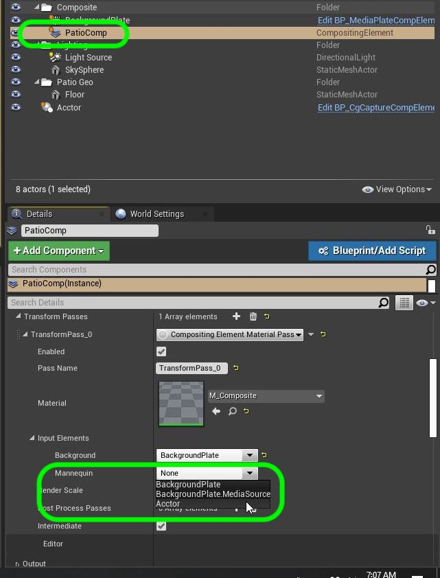
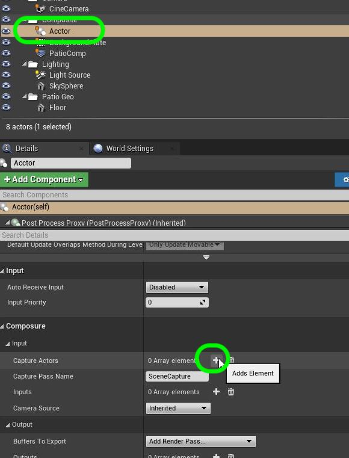
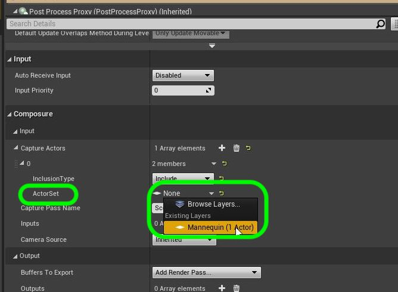
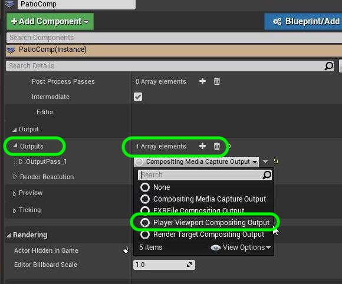
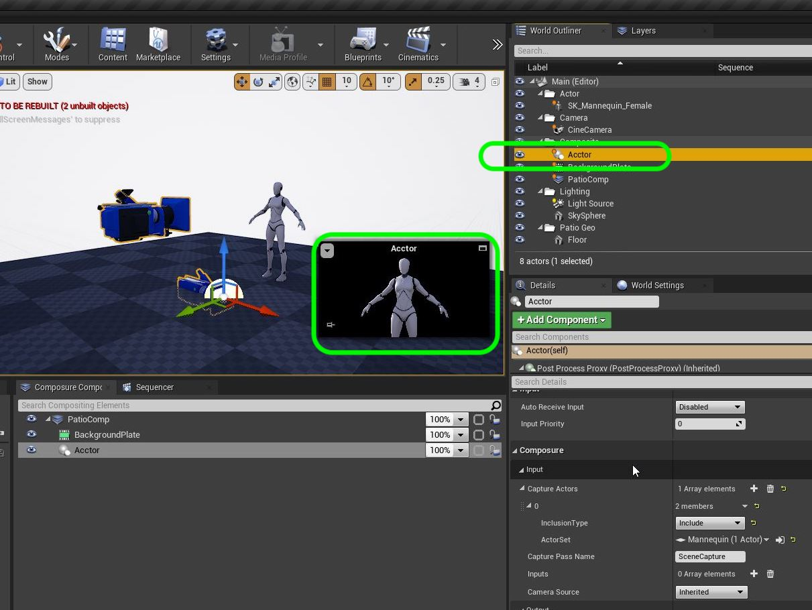
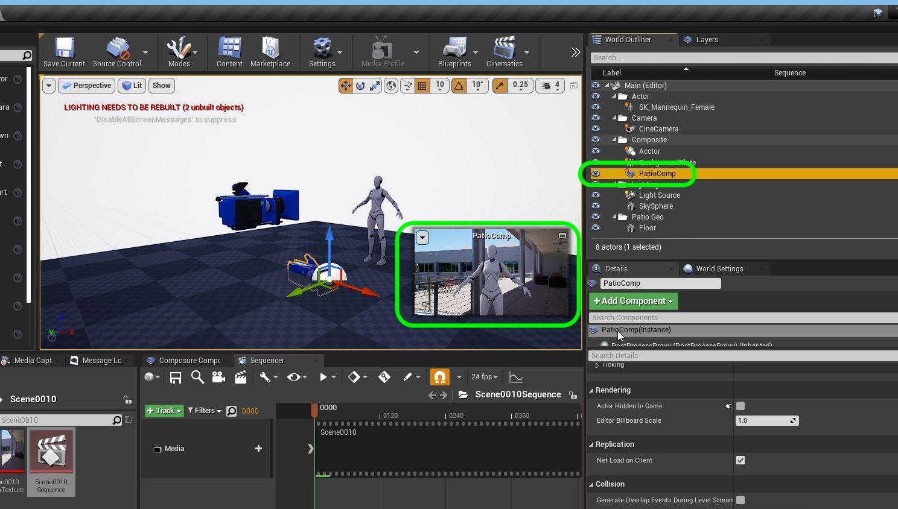

[Next Chapter - Add Animation to Camera and Mannequin](../mannequin_anim/README.md)&nbsp;&nbsp;&nbsp;<------>&nbsp;&nbsp;&nbsp;[Back to Home Page](../README.md)

## Add CG Character To Composite II

1. Now move this new comp layer in the **World Outliner** to the **Composite** folder.  Notice that it is showing the ground and sky.  We just want **ONLY** the player to *key* over the background.

***

2. Now what we need to do is isolate the player into a level.  Select the mannequin in the level so it is seledted in the **World Outliner**.  Click on the **Layer** tab and right click in the empty area and add a **Add Selected Actors to New Layer**.

***

3. Rename the layer to **Mannequin**.  Now lets test our work. Click on the **Eyball** icon on and off and the player should appear and disappear.  This confirms that we have isolated the player.  Now make sure you turn the eyball back on so we can see the player again.

***

4.  Now our composite material **M_Composite** only sends the background layer to the material node.  We need to have the player cg level to key OVER the backgorundl  Open up **M_Composition** and add a new **Texture Sample 2D** node.

***

5. Call this new node `Mannequin`.

***

6. Lets add an **Over** node by right clicking on the graph.  This will put the mannequin OVER the background video.

***

7. The over node is a 4 channel node with an Alpha so it can key the alpha.  So you need to take the **RGBA** out of each **2D Texture Sampe** and send it to the **Over** node with the **Mannequin** rendered ON TOP of the **Background**.

***

8. Now we need to change the materail type.  First we want to make sure that this material is the LAST one to run.  So we don't want this material to composite the scene before all other materials have run.  We also want to set the material decal blend mode to transluscent so it can apply an alpha.  Change **Decal Blend Mode** to `Translucent`.  Make sure **Blend Mode** is still `Opaque`.  Change the **Material Domain** to `Post Process`. Press the **Apply** button.

***

9. Now go back to the **Patio Comp** in World Outliner and open up the comp material in the **Transform Passes**.  You will have a new node selection called **Mannequin** where you will select the comp layer for the CG actor which I called **Actor**.

***

10. Now we need to tell the **Actor** comp layer that we want to ONLY use the layer and not the entire CGI scene.  Select the **Actor** comp layer and press the **Composure | Input | Capture Actors | +** button.

***

11.  Select the **Capture Actor | Actor Set** and change **None** to `Mannequin` the layer we just created.

***

12. Now we need to output the comp so we can see it in the game window.  Go to **Patio Comp** and select **Outputs** and press the **+** button if there is no output layer.  Then set **OutputPass_1** to `PlayerViewportCompositingOutput`.

***

13. Now we can select the **Actor** comp layer in the World Outliner and now the comp should ONLY show the mannequin on a black keyable background!

***

14.  Now when you select the **PatioComp** in the world outliner you should see the player composited on top of the CG background!  Isn't that amazing! Next up we will get player animation running.

***

[Next Chapter - Add Animation to Camera and Mannequin](../mannequin_anim/README.md)&nbsp;&nbsp;&nbsp;<------>&nbsp;&nbsp;&nbsp;[Back to Home Page](../README.md)