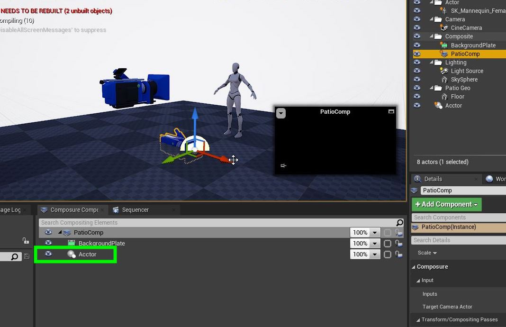

## Add CG Character II

1.  OK, now we are well set up to create our first 2-D composite.  Go to the **Composure** tab and right click on the parent component and select **Add Layer**.

***

2. Now the first layer was a video and a media layer.  The manequin is in UE4 CG so select a **CG Layer**.

***

3.  Name this new comp layer **Actor**.

***

4. Now move this new comp layer in the **World Outliner** to the **Composite** folder.  Notice that it is showing the ground and sky.  We just want **ONLY** the player to *key* over the background.

***

5. Now what we need to do is isolate the player into a level.  Select the mannequin in the level so it is seledted in the **World Outliner**.  Click on the **Layer** tab and right click in the empty area and add a **Add Selected Actors to New Layer**.

***

6. Rename the layer to **Mannequin**.  Now lets test our work. Click on the **Eyball** icon on and off and the player should appear and disappear.  This confirms that we have isolated the player.  Now make sure you turn the eyball back on so we can see the player again.

***

7.  Now our composite material **M_Composite** only sends the background layer to the material node.  We need to have the player cg level to key OVER the backgorundl  Open up **M_Composition** and add a new **Texture Sample 2D** node.

***

8. Call this new node `Mannequin`.

***

9. Lets add an **Over** node by right clicking on the graph.  This will put the mannequin OVER the background video.

***

10. The over node is a 4 channel node with an Alpha so it can key the alpha.  So you need to take the **RGBA** out of each **2D Texture Sampe** and send it to the **Over** node with the **Mannequin** rendered ON TOP of the **Background**.

***

11. Now we need to change the materail type.  First we want to make sure that this material is the LAST one to run.  So we don't want this material to composite the scene before all other materials have run.  We also want to set the material decal blend mode to transluscent so it can apply an alpha.  Change **Decal Blend Mode** to `Translucent`.  Make sure **Blend Mode** is still `Opaque`.  Change the **Material Domain** to `Post Process`.

***

--- [Next Chapter - Level Sequence Player II](../cg_character_ii/README.md) ------ [Back to Home Page](../README.md)