## Importing EXR Sequence 

1.  First lets get started by creating a composite.  Think of this as like a **After Effects** project where the 2-D compositing will take place. Select the **Composure** tab at the bottom.  If this does not show up go up to **Window | Composure Compositing**.  If this does not show up you do not have the plug-in installed. **Right Mouse Click** in the empty area in the tab and select **Create New Comp**. 

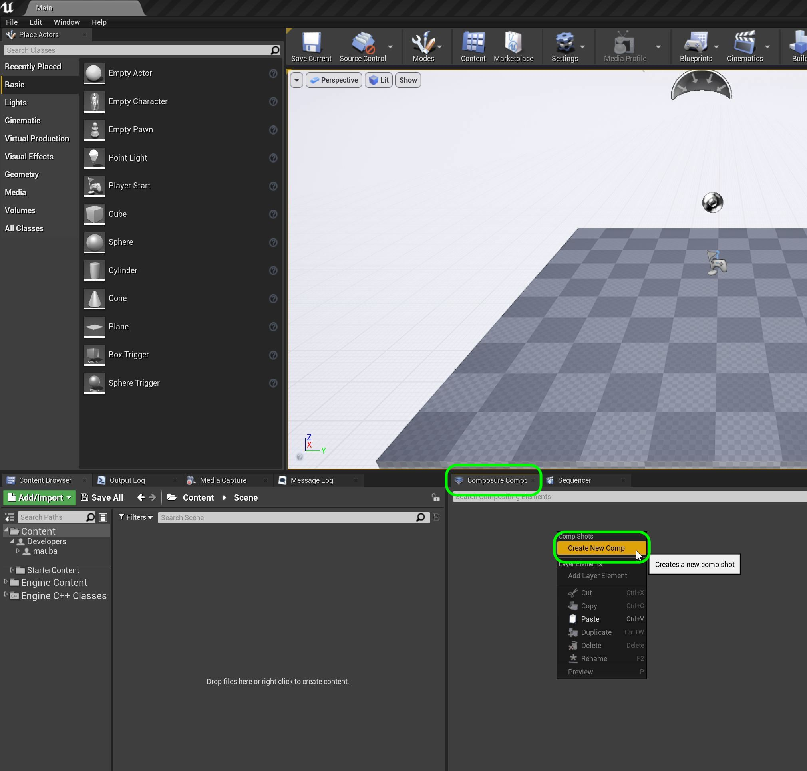

***

2.  Select an empty composite by pressing the **Empty Comp Shot** button.
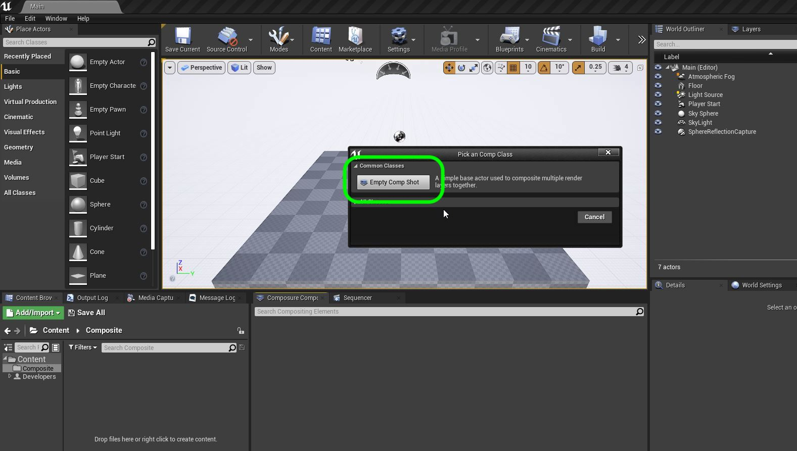

***

3. Rename this layer **Patio Comp**.

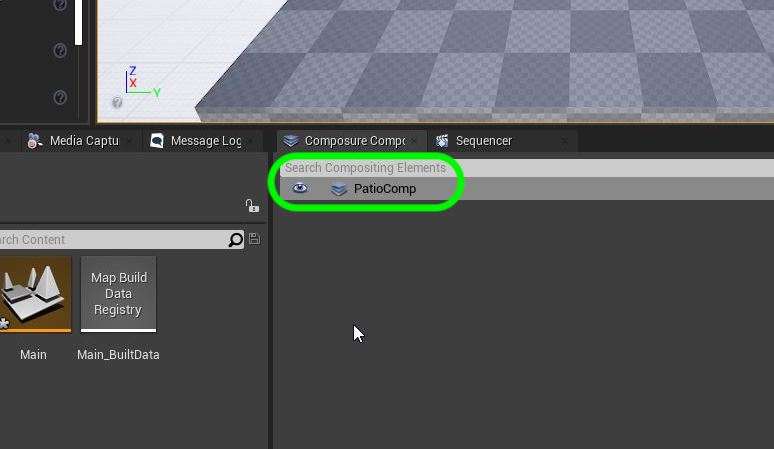

***

4.  Right click on the **PatioComp** name and select **Add Comp Layer**.

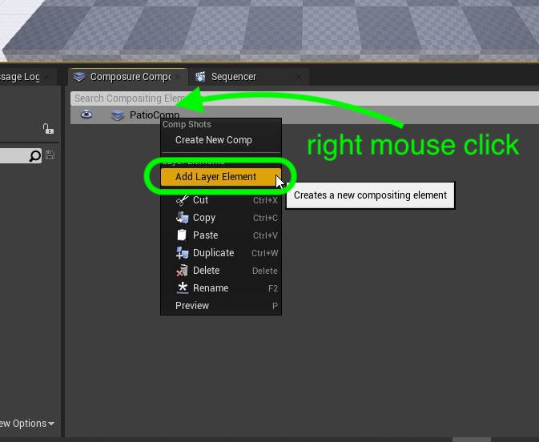

***

5. Now we will be adding the background film plate that was shot in camera.  Press the **Add Media Plate** button.

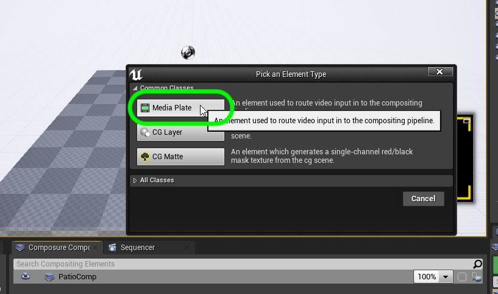

***

6. Now it looks like nothing happened.  In the Unreal editor a lot is hidden inside these little arrows that expand.  Press the **Arrow** next to the name of the comp and you will see the media plate.  Rename it to `BackgroundPlate`.

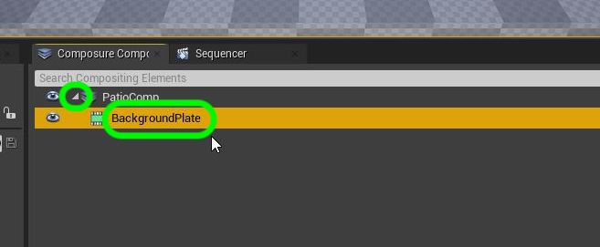

***

7.  This sequence is based on **Epic's** [documentation](https://docs.unrealengine.com/en-US/WorkingWithMedia/MediaFramework/HowTo/ImgMediaSource/index.html).  We will not be importing First lets create a new folder called `Plates`. First to see our folders in our project click on the little arrow in the **Content Browswer** tab.  Right click on **Content** and select **New Folder**.

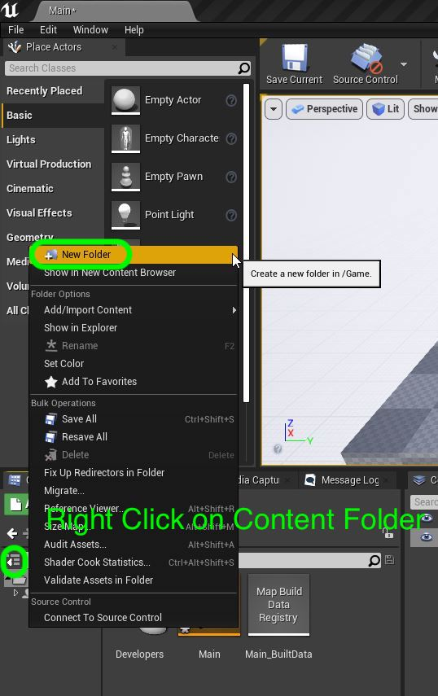

***

8. Rename the folder to **Plates**.

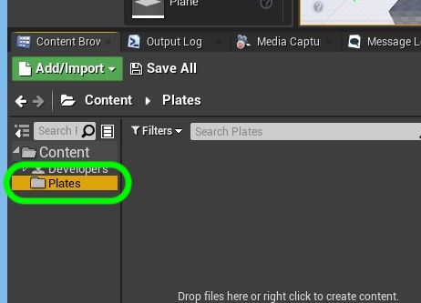

***

9.  Now normally we always import assets through the Unreal interface.  This is the **ONE** exception.  We will be adding the **.exr** files manually into the project and they will **NOT** show up in the browser. Right click on plates and select **Show In Explorer**. Now we are not importing a movie but individual files.  It is better in practice and recommended by Unreal not to import a movie file format such as **mp4**.  Go to [open ext](https://en.wikipedia.org/wiki/OpenEXR) to learn more about the format.

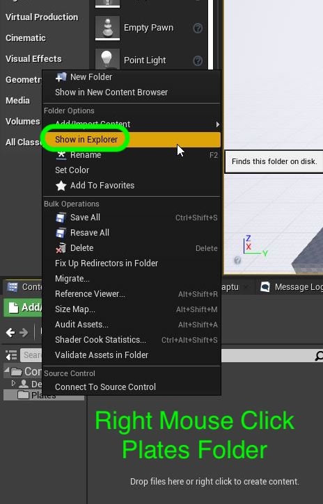

*** 

10. Now everything that we want to use **HAVE** to be in the **Content** folder.  This should open up the location of your project inside the **Content/Plate** folder.  It should be empty.

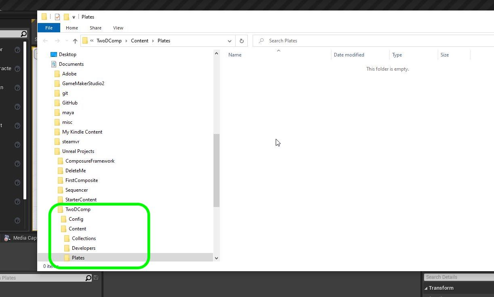

***

11. Copy the three folders in **shot010**.  These should be called **distortion | matte | plate**.  Drag all three into the empty **plates** folder in the Unreal project.

***

12. It is very important that now Unreal will see these as game textures.  It is **VERY IMPORTANT** to **NOT IMPORT** these textures.  We will have them in the folder but not see them.

***

13.  The folders will look empty.

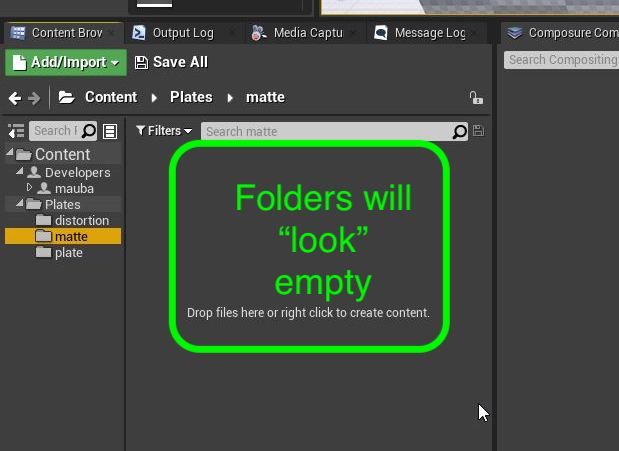

***

14.  Right click on **Content** and add two folders **Scenes | Scene0010**.

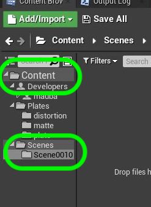

***

15. Now we will be importing these individual .exr frames as a single streamable movie.  Right click on the **Scene0010** folder and press the **Add Import | Media | Image Media Source**.

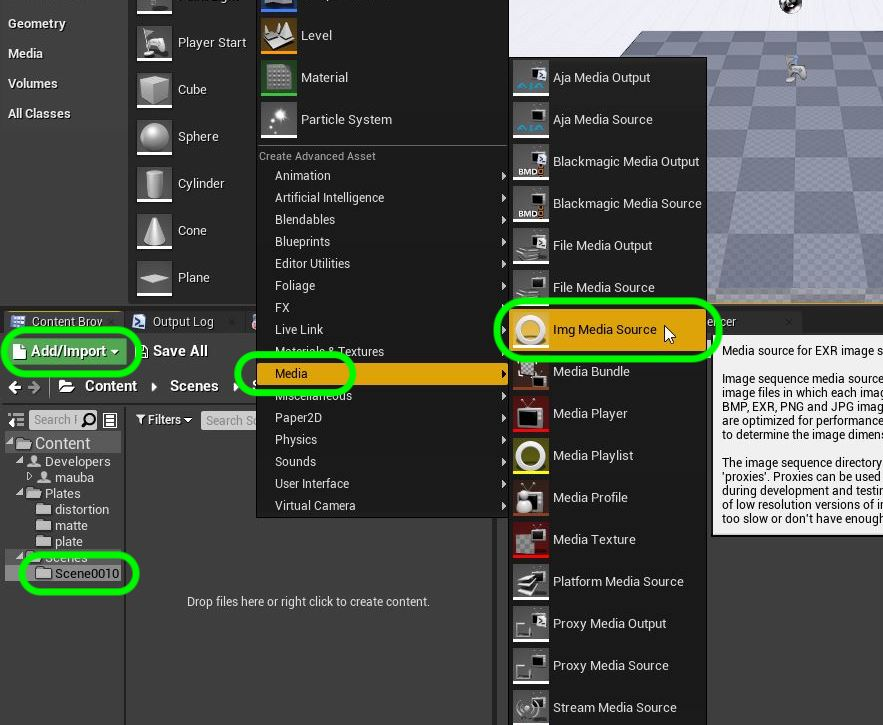

***

15. Now we will be importing these individual .exr frames as a single streamable movie.  Right click on the **Scene0010** folder and press the **Add Import | Media | Image Media Source**.

***

16.  Rename the clip to **Scene0010**.  Double click to open the media source so we can point it to the correct folder:

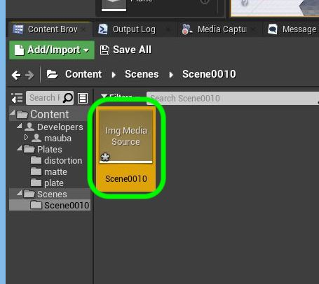

***

17. Now press the three ellipses (...) and then select the folder that contains the plate which should be **Content | Plates | plate**. Select the very first frame then press the **Open** button.  You do not need to select all the exr's it will read all of them alpha-numerically in the folder.  Be careful when naming these files and notice the leading number.

***

18. Now we need to tell the software what framerate this scene was shot at.  It is shot in **24 Frames per Second**.  Click on the small arrow and select the correct framerate in the **Framerate Override**.

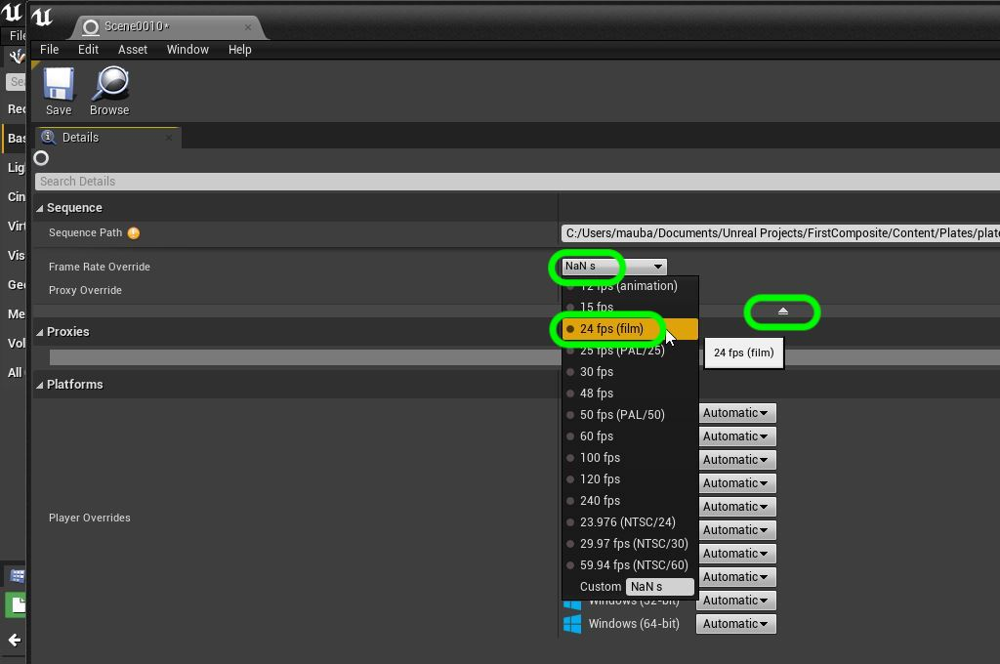

***

19. Now we have imported the clip but we can't view it.  One way of viewing it is by creating a **Media Player**.  But we will not need to as we will include it in a **Sequence** that will play it back.  That is what we will do next.
 
 ***

20.  First lets save our progress with **File | Save All**.

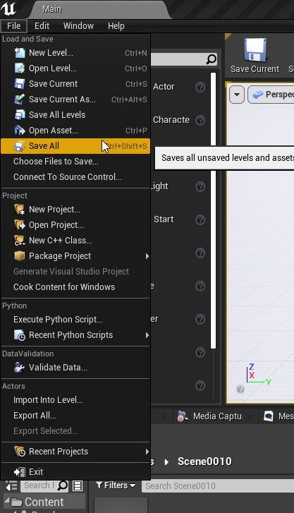
 
 ***

--- [Next Chapter - Level Sequence Player](../first_sequence/README.md) ------ [Back to Home Page](../README.md)