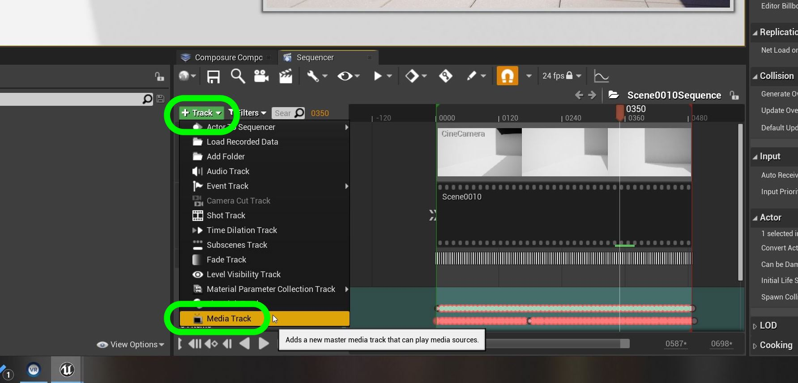

## Lens Distortion

1.  No real world lens can have no distortion. Every camera lens has a level of distortion.  Think of this as shooting a piece of graph paper and seeing that all lines are parallel.  So we want to match the skewing of the lens. Go back to the **Sequence** as press the **+ Track** button and add another **Media Track**.

***

2.  We need to import the single frame for the lense distortion.  Click on the Scene0010 folder and press the **Add/Import** and add another **Image Media Source**.

***

3. So double click the media source and point it to the **Plates | Distortion** folder.

***

4.  Call this new imported source `Scene0010LensDistortion`.

***

5. Add another **Media | Media Texture** to the **Scene0010** folder.

***

6. Now go back to **Sequencer** and right click on the newly added **Media Layer** and select the **Scene10LensDistortion** plate.

***

7. Now we need to apply the distortion in our composite.  Click on **Patio Comp** and add a new **Media Layer**. Name the layer **Lens Distortion**.

***

8.  Go back to sequencer and right click on the new **Media Layer** and select **Edit Section | Media | Media Texture** and assign the new media texture for the lens distortion.

***

9. Confirm **Media Texture** is correct.  It is very subtle.

***

10. Now we need to implement the distortion.  Open up **M_Composite** and right lcick on the graph and add another **Texture Sample Parameter 2D**.

***

11. Call this node **Lens Distortion**.

***

12.  Add a **Math | Component Mask** to just get the **R G** channels and filter out the blue channel.

***

13. Add a **Screen Position** node to get the camera viewport **UV**.

***

14. Right click and selet **Add** to put another node in the graph the will add the viewport UV with the camera distortion.

***

15. Add the **Screen Position** to the **Mask** node and alter the **UV** node of all game scene renders.  In my case it is the **Mannequin**, **Shadow**, and **No Shadows**.

***

16. Now in the game we have not assigned the texture to the math so the image is severely distorted.  Don't worry we will fix it. If you do **NOT** see the **Lens Distortion Input Element** then go back to the material and move a node around and press **Apply** again.  Often I have to do this a few times before it shows up in the **Patio Comp** details panel. 

***

17. Add the **Lens Distortion** composite layer to the **Patio Comp** input. We now have lens distortion to match the camera.

***

18. Next up we will add another scene.

***

--- [Next Chapter - ??](../shadow_matte/README.md) ------ [Back to Home Page](../README.md)