## Add Animation to Camera and Mannequin

1.  Now we need to animate the camera and the actor in the scene so it matches the camear path originally shot.  Make sure you have selected **Scene0010Sequence** and press **+ Track** and select a **Camera Cut Track**.

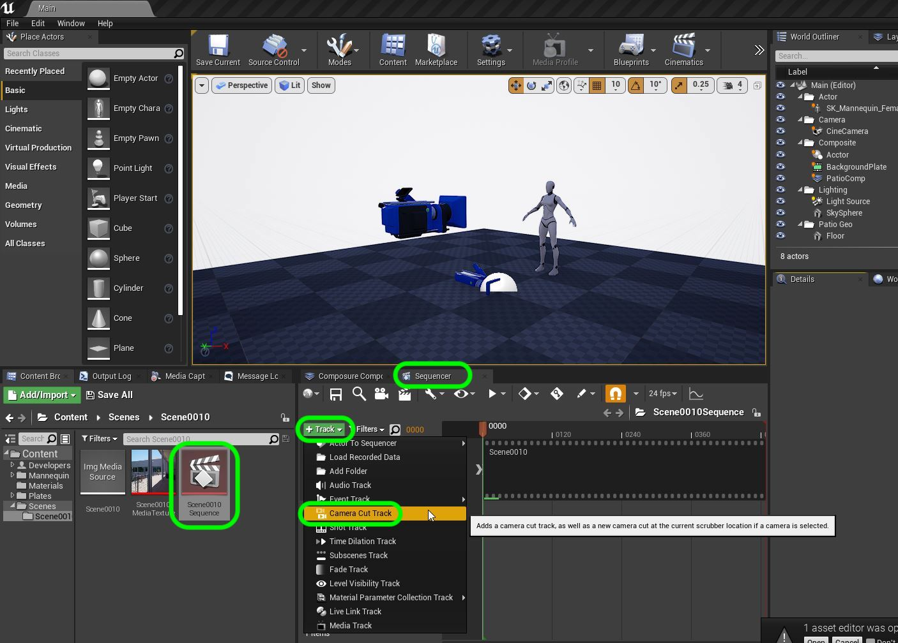

***

2.  Now we need to assign a camera to the cut track.  Press the **+ Camera** button and select the only camera we have in the scene **CineCamera**.
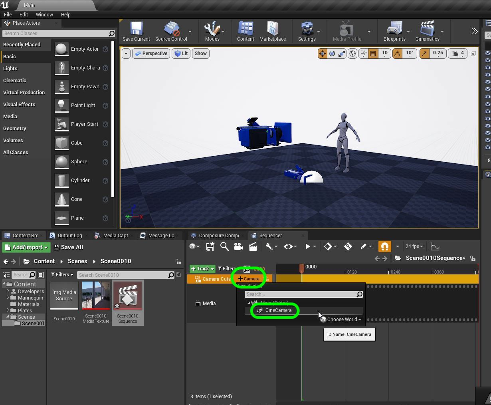

***

3.  We need to delete all elements under the camera (???).  UE4 does not have the ability to derive a virutal camera position from a film plate.  You need to use software like ****Nuke** as well as numerous other options to get a camera FBX.  This has been done by Unreal for us so we can just import it (this does not come from the camera footage).  Right mouse click on **CineCamera** and select **Import**.

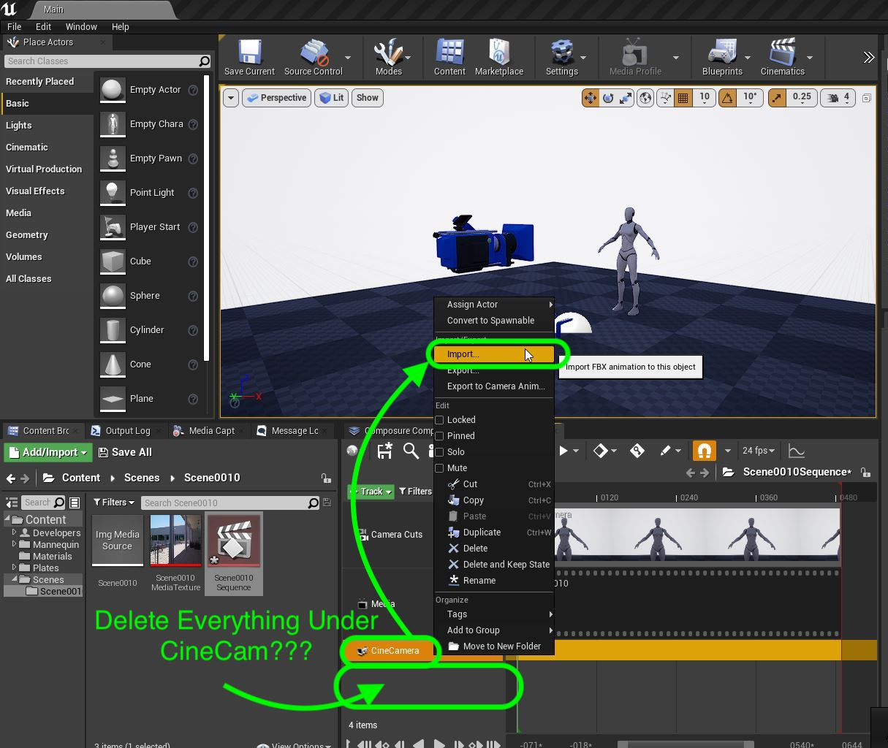

***

4. Pick the file **tracked_cam.fbx**.

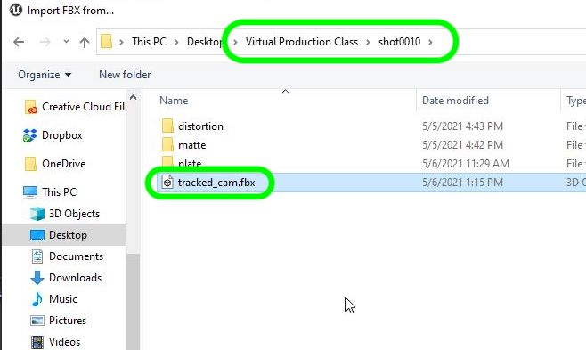

***

5.  Leave the defaults in the pop-up and select the **Import** button.

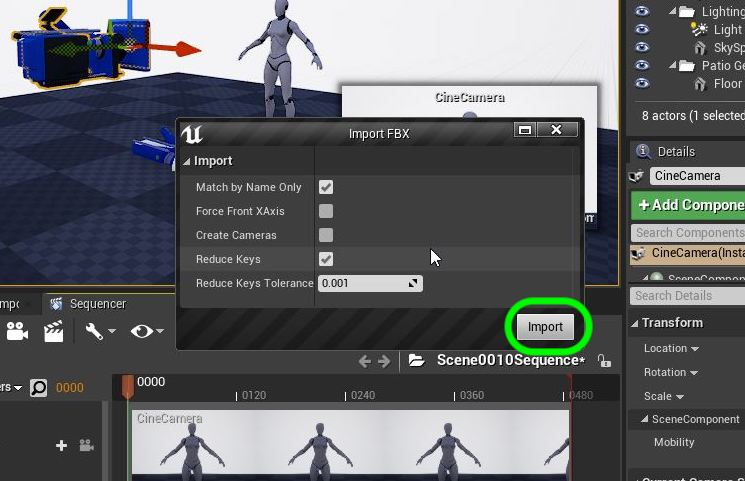

***

6.  Now make sure the **CineCamera** has a **Camera Component** and its transform has keyframes for **Location** and **Rotation**.
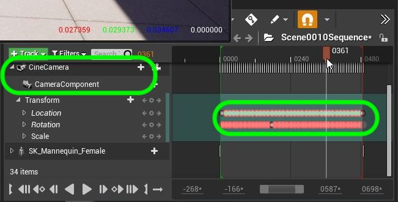

***

7.  Now when you hit play you will notice the camera move.  You should see the camera track appear and the camera moving around it.  Now this doesn't do us much good without animation.  Lets add the mannequin to the scene next.

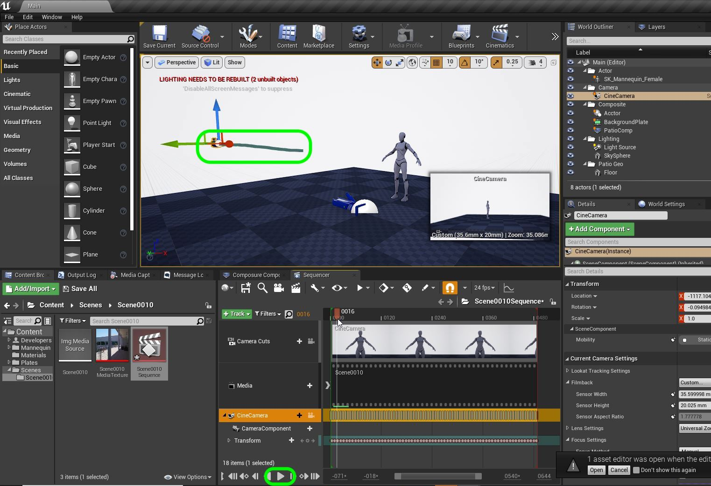

***

8. Now we need to add an animation to our character.  Drag the **Mannequin** from the **World Outliner** to the timeline in **Sequencer** to add it as a layer.  Double check that **Location Y** is `-140` and **Rotation Z** is `5`. This is the local offset so that the mocap data walks in the right direction from the right starting point that matches the camera track in the scene which is *following* to mannequin as you will see in a moment.

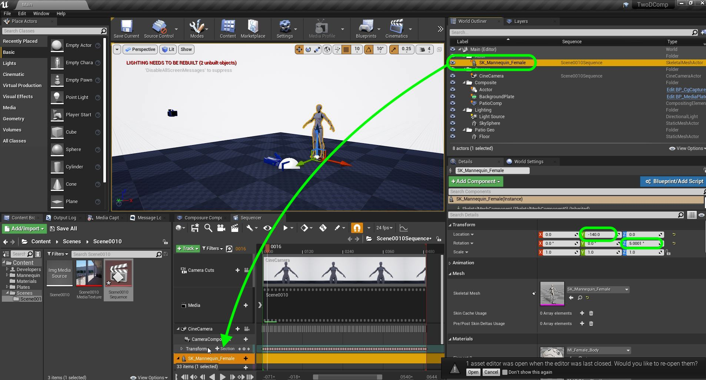

***

9.  Create a new folder to hold the animation inside **Content | Mannequin | Character** and call it `Animation`.  Press the **Add/Import** button and select **Import Asset**.  Then find the **mocap_patio_walk.FBX**.  Press the **Open** button.

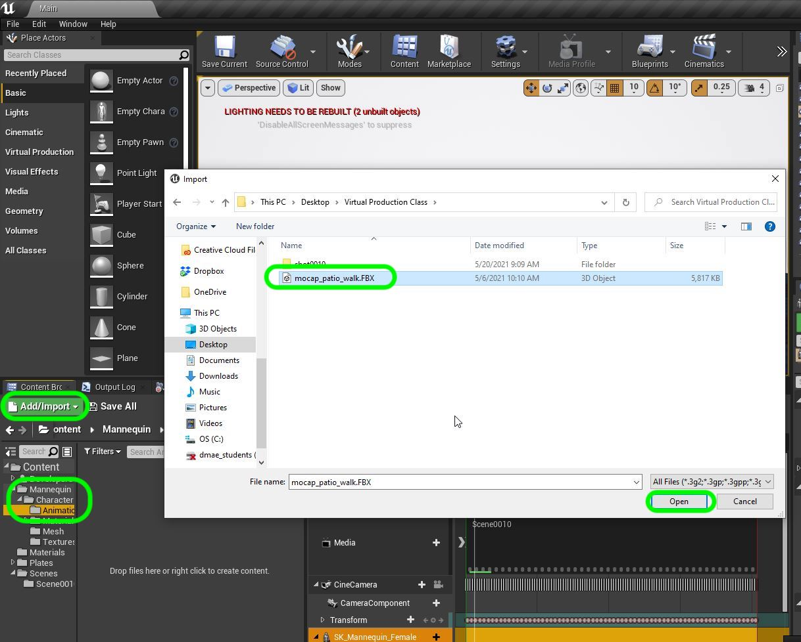

***

10. This brings up the **FBX Import Option** pop up.  Now the only thing we need to assign is a **skeleton**.  Every animation is solved to a specific skeleton topography and cannot be shared without retargeting.  This is designed for the UE4 skeleton to assign to **Skeleton** `UE4_Mannequin_Skeleton`.

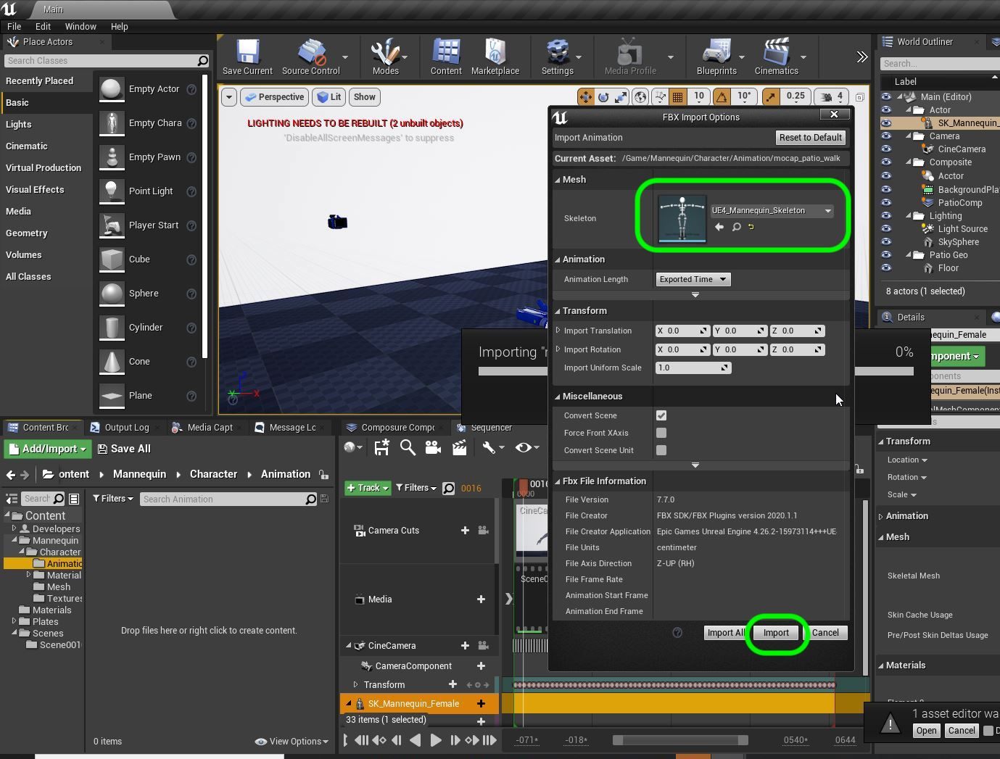

***

11.  Now we can drag the newly imported animation on top th ethe **Mannequin** in the **Sequencer**.  You will see an icon light up and you can drop it there.

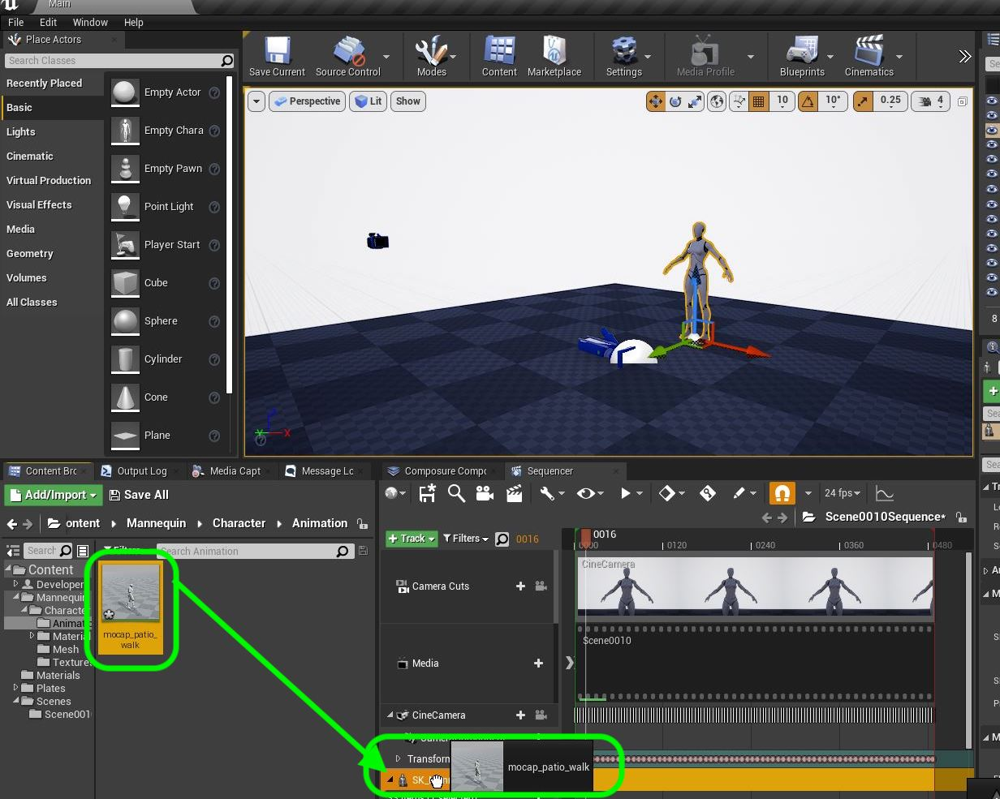

***

12.  There is a scrub bar in the **Sequencer** timeline that you can scrub.  You should see the mannequin walking across the air.  This is motion captured animatoin and not how we construct it for a game.  The motion capture reflected the speed that the original camera was shot.

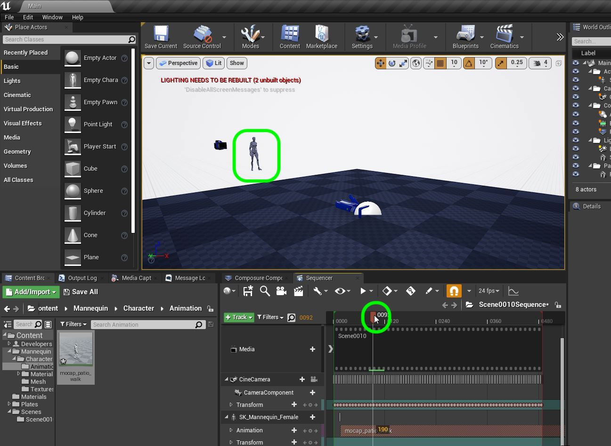

***

13.  Now we can select our **PatioComp** node and hit the play button and see our scene with camera and character animation!

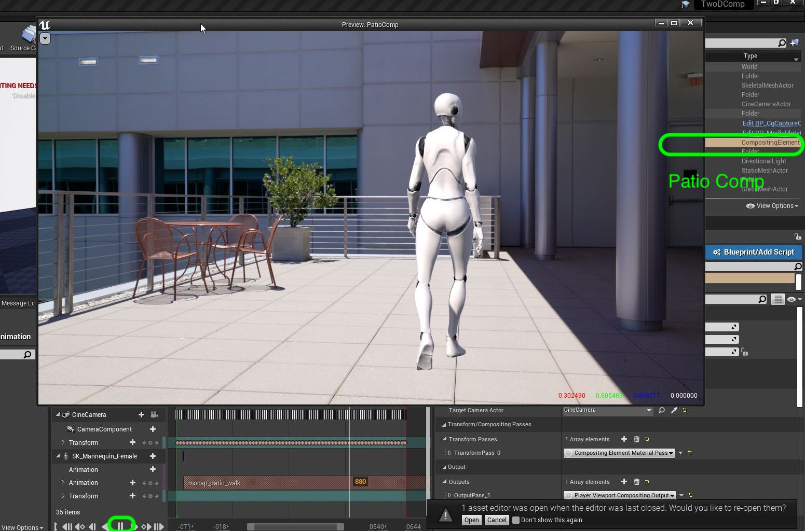

***

14.  The capture is longer than we need.  The original edit of this piece has the animation starting at frame `17`.  Drag the animation back so that when you scrub to timeline **0** that it is at frame `17` of the animation. Trim the length of the mocap animation to match the length of the clip at the begining and end. Next up lets add a shadow so they mannequin's shadow *shows up* in the 2-D clip.

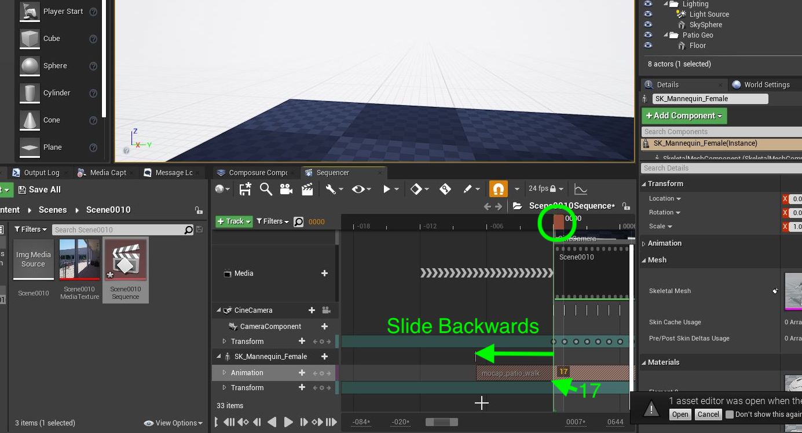

***

--- [Next Chapter - Add Shadow](../shadow/README.md) ------ [Back to Home Page](../README.md)