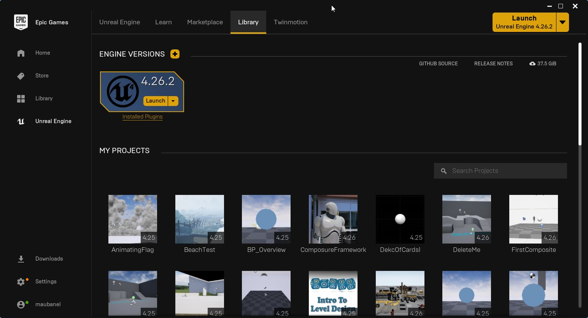
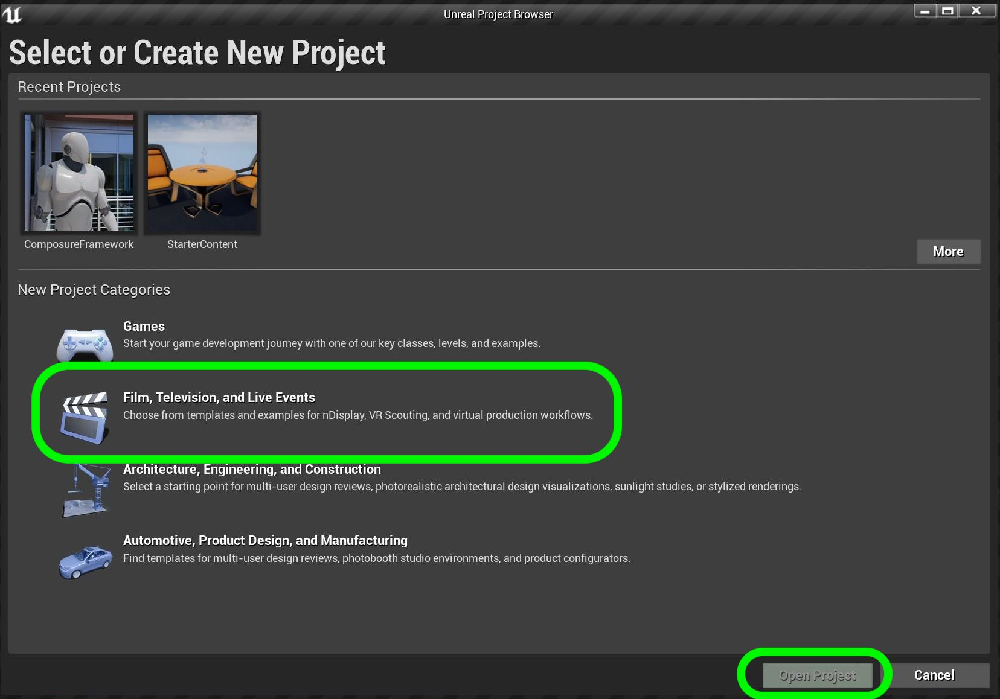
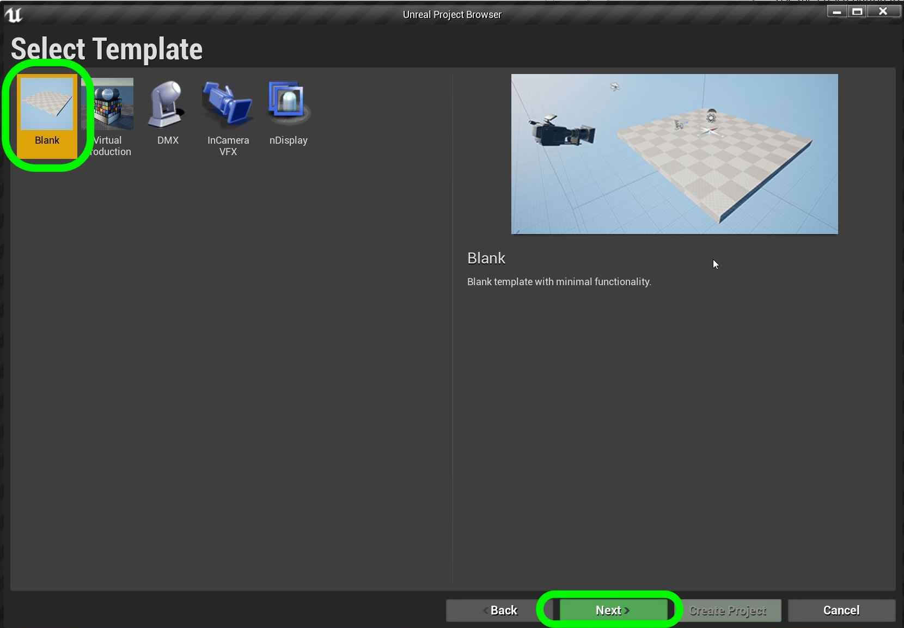
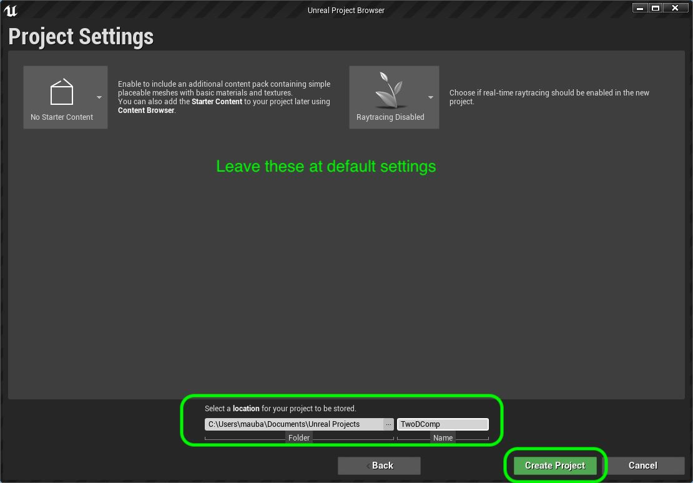
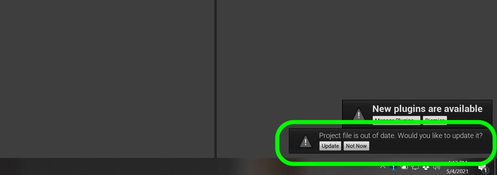
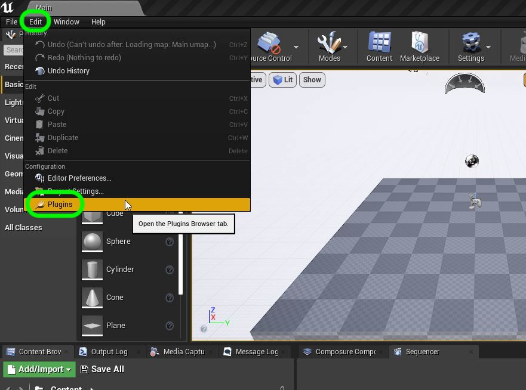
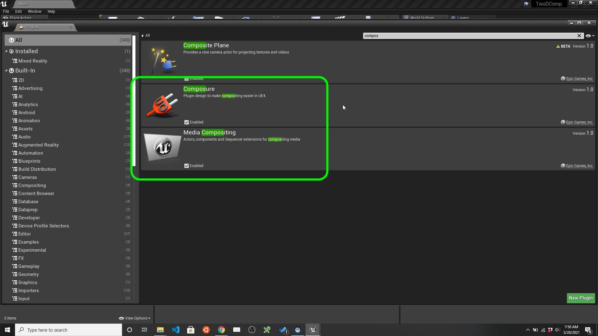

## Setup

1. Make sure that you are running the project on Windows 10.  The plug-ins are not mac compatible at this moment.  Your PC should have 16 gigs of RAM as this work is very power hungry.  It is recommended that you have a good gaming video card and that you plug-in your laptop as this work uses most of your available processing power.

***

2.  Install [Epic Games Launcher](https://www.epicgames.com/store/en-US/download) and sign up for a free account.

***

3.  Install UE4 4.26.XX (any version of 4.26 should work).  We will be working in 4.26 for the remainder of the class and will not be updating to any new versions.  This can found in the **Unreal Engine | Library** folder.

***

4. We have different starting templates we can use.  For this 2-D Composite, we will be selecting Film, Television, and Live Events. Press the **Next** button.

***

5. Sele
ct a blank project as we will starting from scratch. Press the **Next** button.

***

6. Leave the settings at default and select a local folder to store your projetc.  This will create a folder with the name of the project you entered.  I called mine `TwoDComposite`.  No spaces can be used in a project name. Make sure you **do not** store this on a cloud based folder this needs to be on your local hard drive.

***

7. ou might get a pop up prompting you to update the project.  Please the **Update** button to get the latest version (think of this as a day 1 patch in a game). 

***

8. Y If you have made a game in Unreal this looks exactly like a blank game project.  So what is different?  Press **Edit | Plugins**.

***

9. Type in `comp` and see that there are some plugins installed that are required for compositing.  If at any point you do not see the feature that is mentioned in this walk through it is most likely because you are missing a plugin.  In this case all of the plugins we need *should* be pre-installed in this default project type.

--- [Next Chapter - Basic Comp](../basic_comp/README.md) --- [Back to Home Page](../README.md)

