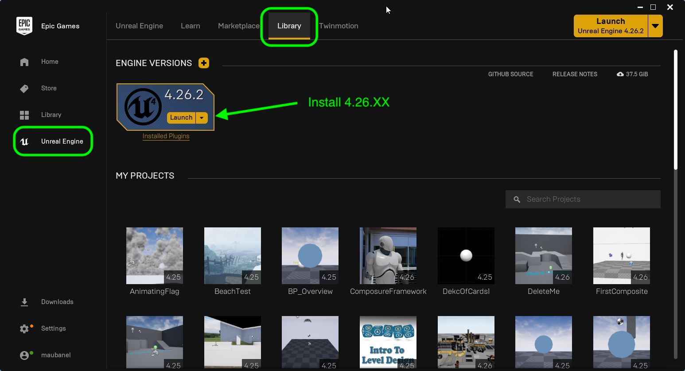

## Setup

1. Make sure that you are running the project on Windows 10.  The plug-ins are not mac compatible at this moment.  Your PC should have 16 gigs of RAM as this work is very power hungry.  It is recommended that you have a good gaming video card and that you plug-in your laptop as this work uses most of your available processing power.

***

2.  Install [Epic Games Launcher](https://www.epicgames.com/store/en-US/download) and sign up for a free account.

***

3.  Install UE4 4.26.XX (any version of 4.26 should work).  We will be working in 4.26 for the remainder of the class and will not be updating to any new versions.  This can found in the **Unreal Engine | Library** folder.

***

4. We have different starting templates we can use.  For this 2-D Composite, we will be selecting Film, Television, and Live Events. Press the **Next** button.

***

5. Select a blank project as we will starting from scratch. Press the **Next** button.

***

6. 
projectSettings