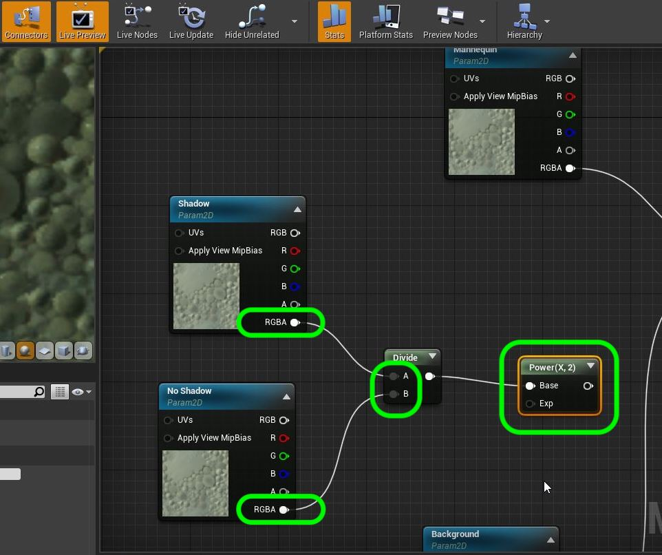

[Next Chapter - Add Shadow Matte](../shadow_matte/README.md)&nbsp;&nbsp;&nbsp;<------>&nbsp;&nbsp;&nbsp;[Back to Home Page](../README.md)

## Add Shadow

1. Now our current scene does not factor in the ceiling.  We want the player's light to be affected by it.  We will need to add this to our **Actor** layer comp.  Lets start by select the **Ceiling** object in the W and going to the **Layers** tab and right clicking creating a new layer with this object.  Name it `Ceiling`.  

***

2.  Now open up the **Composure** tab and select the **Actor** layer. Go to **Input | Capture Actors** and press **+**.  Then select the new **Ceiling** layer to add to this scene so that it impacts the lighting.

***

3.  You will notice a small difference when the player goes into and from shadows when you scrub the scene.

***

4. Now we need to add a layer to our composite with the player, the ground and shadow and the white sky sphere.  We also need another layer with just the player and the sky sphere but no ground/or shadow. We will then take a difference between them to extract the shadow and project it onto the background plate.  Go to **Composure** and right click on **Patio Comp** and add a third **Layer Element**.

***

5. This will be a CG layer. Name it `Shadows`.

***

6. Do the same thing again and name this third CD layer `NoShadows`.

***

7. Now lets select the **SkySphere** and create a self-named layer for it as well.

***

8. Now select the **Shadows** composite layer in the World Outliner and press **Input | Capture Actors +** button 3 times.

***

9. Now we can assign the layers that will be seen in the shadow comp layer.  Add to **Input | Capture Actors | ActorSet** `Mannequin, Floor, Skyspehere` to the three slots.

***

10.  Now I cannot see a shadow on the ground.  That is because the sky sphere is so bring that it is filling in the shadow from our directional light.  So go to the **Sky Sphere** in World Outliner and turn **Lighting | Cast Shadow** off.

***

11. Now our mannequin is casting a nice soft shadow on the ground.

***

12.  Repeat this for the **NoShadows** comp layer but just include the mannequin adn the sky box.  This will have exactly the same thing without a shadow.

***

13.  Now open up **M_Composite** and add two **TextureSampleParameter2D** nodes calling one **Shadow** and the other **No Shadow**.  Drag from the RGBA pin and select a **Divide** node.  We will be dividing the NoShadow layer into the Shadow layer.

***

14. Now put the **Shadow RGBA** pin into the **A** side of the **Divide** node.  Put the **No Shadow RGBA** pin into the **B** side.  Take the output of the **Divide** node and add a **Power(x, 2)** node.

***

15. We will temporarilly take the output of the **Power** node and plug it into the **Emissions** channel in the material so we can see what this does.

***

16.  This kind of removes the player and sharpens the shadow.  Rembemer if we multiply this the white does nothing but black will darken pixels. Since we squared the last node values might go above **1.0**.  So we add a **Saturate** node to make sure that the values do not exceed 1.  No visual difference glows can happen at edges if you overload an emmissive channel (like a glowing lightbulb).

***

17.  Take the output of the **Saturate** node and add a **Multiply** node.

***

18.  Now multiply the **Background** by the **Saturate** node and reconnect the **Over** node to the **Emmisions** channel. Add a comment to the nodes to describe what they do.

***

19.  Now we have a beautiful shadow in the level.  It looks like we projected it onto the ground in the original set!!!  We have one major problem.  Our shadow casts a shadow on the shadow, which doesn't make sense. In our next section we will address this.

***

[Next Chapter - Add Shadow Matte](../shadow_matte/README.md)&nbsp;&nbsp;&nbsp;<------>&nbsp;&nbsp;&nbsp;[Back to Home Page](../README.md)