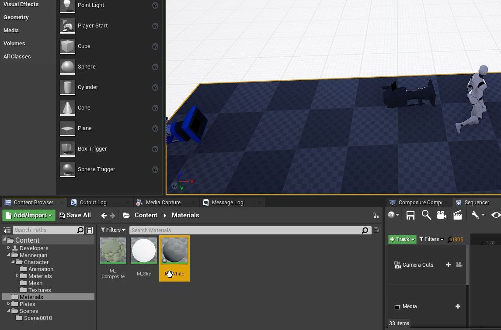
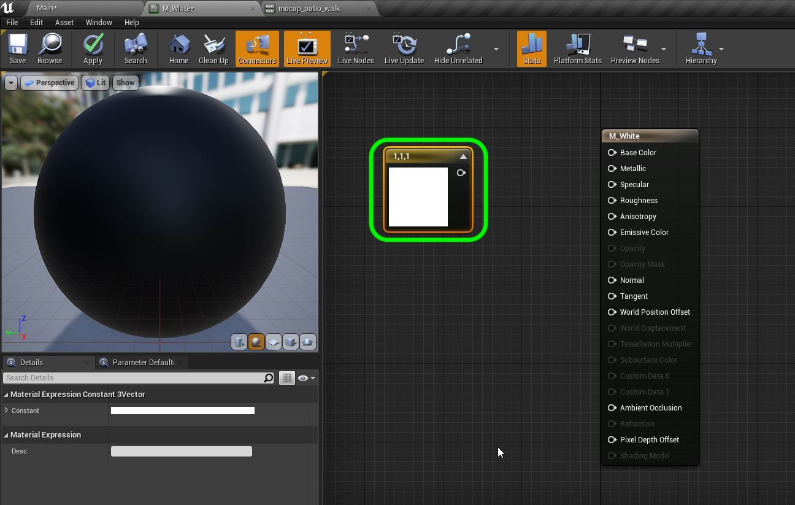
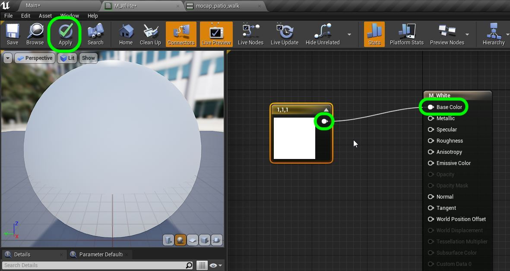

## Add Shadow Matte

1.  Now lets look at the lighting in our scene.  First, we need to adjust our **Directional Light** which in UE4 represents the **Sun**.  This light's location is irrelevant as its light rays extend to infinity.  What we want to do is match the direction of the sun in the scene that was shot.  We can look at the shadow in the scene as well as the texture used in the **Skylight** as a hint.  Enter the **Transform | Rotation** to be `-179.9, -73.99, -154.91` for **X, Y & Z**. Now our character is moving and we are not baking our lights so lets make the **Directional Light** movable.

***

2. Now that we have the sun in the correct position we need to figure out how we will project the shadow.  We will need to make a flat white ground and just seledt the shadow portion to add it to the background.  We need this ground static mesh to be at the same level of the ground in the filmed scene.  Lets make a material to start. Go to the **Materials** folder and press the **Add/Import** button and add a new material.  Call it `M_White`.

***

3.  Open up the new material and add a **Vector 3** node.  Change it to `1, 1, 1` for a full white node.

***

4.  Now attach the output of the **Vector 3** node to the **Base Color** input in the material.  Now press the **Apply** button.  That is it for our ground plane to pick up a shadow with no added color.

***

5.  We could assign this new material to the Ground by going through the **World Outliner** and selecting it through the menu.  But it is quicker to grab the material and drop it on the ground to do this in one step:

***

6.  Lets do a bit more housecleaning.  The level/map that UE4 has given us is **Main**.  It is in the root of the **Content Folder**.  Lets add a folder called **Maps** and move **Main** to it.

***

--- [Next Chapter - Add Shadow Matte](../cg_character_ii/README.md) ------ [Back to Home Page](../README.md)