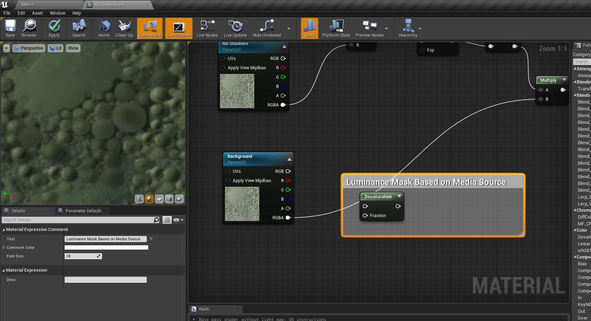
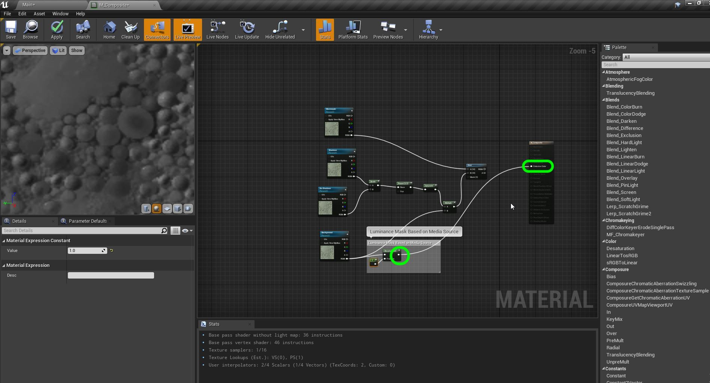

## Add Shadow Matte

1. To do this to *film* standards we would probably create a frame by frame matte to separate the shadow layer.  But UE4 implemented a pretty decent work around that saves having to roto each frame.  What they did was desaturate and reverse the colors so that the light portion with shadows will be the black pixels.  We will take our background and make it look like this:

***

2.  Add a comment to this node (cntrl K) saying `Luminance Mask Based on Image Source`.

***

3. Now connect the **RGBA** from the **Background** plate into the top **Desaturation** node pin.  Create a **Scalar** and make sure it has a value of `1.0`.  Plug that into the **Fraction** pin.

***

4. Lets highjack the **Emissions** pin to preview what a desaturate node does (I assume makes it black and white and removes the color).  WE ARE MISSING A SCREENSHOT OF THE RESULT!!!!

***

5. Now add two **Scalars** with one set to `.05` and the other set to `.5`.  Then take the output of the **Desaturation** node and select a **Misc | Smooth Step**.  Make sure it is in the **MISC** category the other types will not work.

***

6. Wire up the three set of pins as diagrammed below:

***

7. Send the output of the **Smooth Step** to the **Emissions** channel to preview.  We git a higher contrast version of the desaturated plate.

***

8.  Since these materials are 0 to 1 then if we subtract each pixel from 1 we get a negative image.  Right click on the graph and add a **Math | One -** node.

***

9. Now this gives us a deep black where there is the lit portion. We will restrict the shadow to ONLY showing up in black to mask the shadow when it is in the light (remember we are in a negative - so it is opposite).

***

10.  Now since we have done a lot of math some numbers might have gone into negative or beyond a unit of 1.  It is always safe to clamp these with a **Saturate** node.

11. Now we will take each pixel and **LERP** between no shadow a pure white node and the treated background image node where black will cast a shadow.  Right click and add **Math | Linear Interpolate** node.

 

***

12.  Connect the output of the **Power** node to the **A** side of the lerp. Create a Vector 4 note making it solid white that is opaque or a value of `1,1,1,1`.  Connect that to the **B** side of the node.  Connect the **Saturate** node to the inpurt **Alpha** node in **Lerp**.  Connect the output fo the **Lerp** into the **Saturate** node and multiply the output by the **Background**.  Send this to the **B** side of the **Over** node.

 

***

13.  Now preview it in the game and the shadow now stops at the boundary!

 

***

--- [Next Chapter - ??](../shadow_matte/README.md) ------ [Back to Home Page](../README.md)