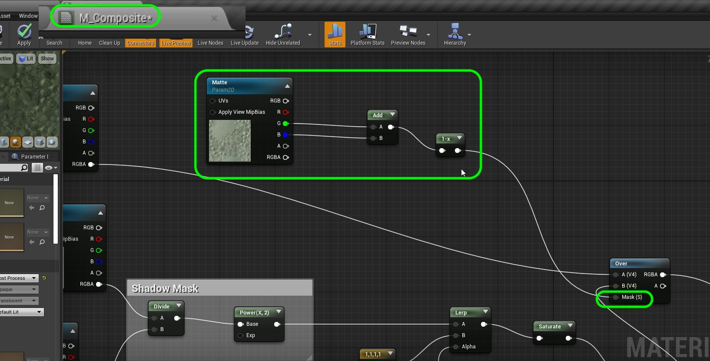

## Third and Fourth Cut

1.  You should know enough about the process by now to complete the third and fourth cut.  You will import the third set of plates, create a new **Media Image Sequence** for the background and the lens distortion.  Add the animation into the scene and import the motions capture.  Drag the camera from the **World Outliner** and import the 3rd camera track to match the last camera. You will notice that the mannequin moves in front of the pillar and the chairs and should be behind them.

***

2. You will need to import a **Matte** layer into the sequence and the composite for shot three.  Create a new **Media Image Sequeqnce** and call it **Shot0030Matte**.  Add another **Media Layer** to the **Shot0030Sequence**.  Create a new **Media | Media** texture.

***

3. Now open up the **Component** tab and add a new **Media Layer** and call it `Matte`.

***

4. Now we need to adjust our compositing material to add this matte.  Open up **M_Composite** and add a **Texture Sample Parameter 2D** node to the chart.  In the Unreal video they mentioned initially wanting two matte layers but ended up only using one.  So we can add the **B G** layer together.  We invert this layer to get the matted section to be black with a **One Minus** node.  We then feed it into the **Matte** pin of the **Over** node.

***

5.  Don't forget to add the source and media texture to the **Matte** track in the **Sequencer**.

***

6.  You should get it so that the player appears behind the objects:

***

7.  For the final cut we do go back to the first view.  But we can't use the same sequence as the start time is wrong.  We need to duplicate it instead.

***

8.  Retrim the final shot so that the animation starts at the point you want it to for the final cut.

***

9.  Export the final movie.

9. Now I went to export the final clip (even though it played back fine) and I had a matte showing up in other scenes without a matte layer.

***

10.  If you have the same problem lets assign a blank matte to the other three scenes. In **Scenes** ad a **Img Media Source** layer and copy over any of the matte layers into the **Plates** folder without importing them (like before).  The matte folder for scene 10 and 20 are the same so you only need one.  Then point the new image source to this one file.

***

11.  Now you can add a **Media** track to the first, second and fourth cut. Don't forget to assign the media texture to it.

***

 ------ [Back to Home Page](../README.md)